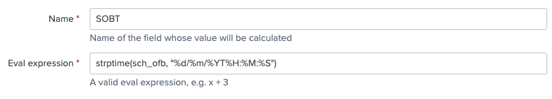

# How to use the CIM

The Splunk4Airports CIM has been compiled using multiple data sources in order to gain a uniformed approach to Airport data. You can see the data sources used in the [Readme](./README.md)

### How does it work

The first step is to identify the various values for the fields listed in the CIM. 
For example; in the Airfield > Aircraft dataset You'll see the following:
| Dataset Name  | Field Name  | Data Type | Description | Examples |
|:--------------|:------------|:----------|:------------|:---------|
|Airfield|flightNumber|int(4)|The numerical flight number of the aircraft|1234|
|Airfield|airline|String|The IATA code for the operating airline|EZY, DY, AA|
|Airfield|FQFC|String|Fully Qualified Flight Code|EZY1234|

These are the first three fields I would start with. So if you connect directly to your AODB through [DBConnect](https://splunkbase.splunk.com/app/2686/), you simply need to find these fields in your dataset and alias them to the CIM field name above. Making sure you conform to the data type. For the most part, data types are free form strings. But all timestamps, unless stated otherwise are in epoch.

### Operational time stamps

Airport data contains a huge amount of operational timestamps. All the way from Scheduled Off Block Time(SOBT) to Actual Take Off Time(ATOT). 

**All timestamps, unless stated otherwise are in epoch. Epoch allows you to perform simple calculations on multiple timestamps**

So in the case of making your timestamps CIM compliant, you may need to apply _strptime_ to them using a [calulated field](https://docs.splunk.com/Documentation/Splunk/latest/Knowledge/definecalcfields)

Lets say, in your data, your SOBT is called _sch_ofb_ and is presented like this: _31/12/2020T09:15:00_

You'd need to create a calculated field using _strptime_ and call it _SOBT_. See image:

