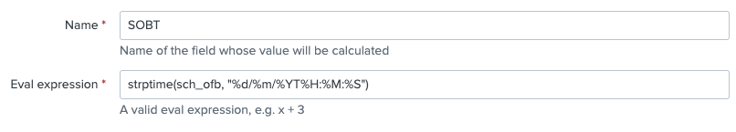

# How to use the CIM

The Airport CIM for Splunk has been compiled using multiple data sources in order to gain a uniform approach to Airport data. You can see the data sources used in the [About](./About.md) page.

### How does it work

The first step is to identify the various values for the fields listed in the CIM. 
For example; in the Airfield > Aircraft dataset You'll see the following:

| Dataset Name  | Field Name  | Data Type | Description | Examples |
|:--------------|:------------|:----------|:------------|:---------|
|Airfield|flightNumber|int(4)|The numerical flight number of the aircraft|1234|
|Airfield|airline|String|The IATA code for the operating airline|EZY, DY, AA|
|Airfield|FQFC|String|Fully Qualified Flight Code|EZY1234|

These are the first three fields I would start with. So if you connect directly to your AODB through [DBConnect](https://splunkbase.splunk.com/app/2686/), you simply need to find these fields in your dataset and alias them to the CIM field name above. Making sure you conform to the data type. For the most part, data types are free form strings. But all timestamps, unless stated otherwise are in epoch.

All field names are camelCase - Excluding acronyms, which are all capitals.

### Flight identifiers

Keep these as separate fields. They are not interchangeable with `FQFC`.

- `airline` is the IATA operator code, such as `BA`. `ICAOAirline` is the ICAO operator code, such as `BAW`.
- `FQFC` is the IATA flight designator, such as `BA353`. `ICAOFlightId` is the ICAO flight identifier, such as `BAW353`. `callsign` is the air traffic control callsign, such as `BAW4EP`, and it often differs from both.
- `flightSuffix` is the single-character suffix on the flight number, when the source has one.
- `codeShares` is a multi-value field. Keep one codeshare designator in each value, such as `AA6705`.
- `serviceType` is the IATA service type, such as `J`, `C`, or `P`. `flightStatus` is the movement status code, such as `SH`, `AB`, or `CX`.
- `cancelled`, `regulated`, and `diverted` are `true` or `false`. If the source sends `Yes` or `No`, normalise that to `true` or `false` before you alias the field.

### The flightUID

In some instances, your data may not give a unique identifier to flights. The flightUID is important because it allows you to run analysis over multiple days where the same FQFC exists. For example, if you search for On-Time Departure information across multiple days using the FQFC, you'll have a hard time differentiating the same flight on different days. If you don't have a flightUID, you can create one using an _eval_
```
| eval flightUID=sha256(FQFC. "" .SOBT)
```

## Time

### Operational time stamps

Airport data contains a huge amount of operational timestamps. All the way from Scheduled Off Block Time(SOBT) to Actual Take Off Time(ATOT). 

**All timestamps, unless stated otherwise are in epoch. Epoch allows you to perform simple calculations on multiple timestamps**

So in the case of making your timestamps CIM compliant, you may need to apply _strptime_ to them using a [calculated field](https://docs.splunk.com/Documentation/Splunk/latest/Knowledge/definecalcfields)

Let's say, in your data, your SOBT is called _sch_ofb_ and is presented like this: _31/12/2020T09:15:00_

You'd need to create a calculated field using _strptime_ and call it _SOBT_. See image:


A feed may instead send an ISO-8601 timestamp such as _2026-09-08T07:10:00+00:00_. Strip the colon from the timezone offset, then convert it with _strptime_ and alias the result to the CIM field name:

```
strptime(replace(sch_ofb, ":(\\d\\d)$", "\\1"), "%Y-%m-%dT%H:%M:%S%z")
```

Estimated landing time (`ELDT`) aliases to `ETDN`. Actual landing time (`ALDT`) aliases to `ATDN`.

### Durations

`AXOT`, `EXOT`, `AXIT`, and `EXIT` are integers in seconds, not epoch timestamps. If the source sends an ISO-8601 duration such as `PT15M` or `PT7M31S`, convert it to seconds before you alias it:

```
| rex field=taxi_raw "PT(?:(?<hours>\d+)H)?(?:(?<minutes>\d+)M)?(?:(?<seconds>\d+)S)?"
| eval AXOT=(coalesce(hours,0)*3600)+(coalesce(minutes,0)*60)+coalesce(seconds,0)
```

### Timezones

Ensure your data is in the timezone that you expect it to be in. Many European Airports use Zulu time as a standard in their Airport Operational Database(AODB). If this is the case, ensure you're aware of what timezones you are using so you can adjust your Splunk settings accordingly. Inaccurate timezones can lead to unexpected search results.

### Which time should I use for _time?

This is up to you, I have seen some airports use _SOBT_, but the most success I have seen is where _lastUpdated_ is used as _time.

If _lastUpdated_ is used as the _time field. It's important to add an _SOBT_ filter to your searches, to ensure you're only searching flights where the _SOBT_ falls within the time picker. The best way I have found to do this is by adding _addinfo_ and using _where_ like in this example:
```
index="flights"
| addinfo 
| where (SOBT>info_min_time AND SOBT<info_max_time)
```
You will see, the Airport App for Splunk expects _lastUpdated_ to be used as _time, and uses syntax like this:
```
stats latest(x), latest(y) by flightUID
```
This ensures you retrieve the latest value for fields X and Y, but in effect, it's also deduping by the _flightUID_.

## Lookups

Various lookups are included in the Airport App for Splunk. The lookups are there to help enrich your data. For example, in your data you'll no doubt have an origin and destination airport. The _airports.csv_ lookup includes all international airports, so you can use the three letter IATA code for the airport, and it will output valuable information, including latitude and longitude. Thus allowing you to create visually stunning geo-maps. Lookups have been used from open source repositories. For a list of data sources, see the [about](./About.md) page. Due to its size, the Airport App for Splunk has a search included that inputs the airports.csv file into the KV store, allowing for faster retrieval.

## Baggage

As there is no known universal schema for overall baggage processing (There are multiple, smaller schemas for different parts of the baggage journey). The CIM was created with the most commonly used fields between them.

Here's an acronym buster for the types of data you may see in your Airport:

| Acronym  | Meaning  |
|:--------------|:------------|
| BTM | Baggage Transfer Message. Usually sent from the inbound carrier to the outbound carrier to inform them about the bags that will be transferred. |
| BSM | Baggage Source Message. These messages are generated for every single bag that is checked in at the airport. |
| BPM | Baggage Processed Message. BPMs are sent locally in the airport whenever a bag has reached a different stage of processing. i.e The bag has cleared security screening, or it's been loaded onto a ULD |
| BUM | Baggage Unload Message. This message is an instruction to the handler to unload a bag from an aircraft. Typically if the passenger did not show up to the gate. |
| BNS | Baggage Not Seen. The passenger is present for the flight, but the bag is not. The bag has missed the connection. Sometimes referred to as an SSB, or Short-Shipped Bag |

The most valuable of these messages are BSMs and BPMs as they will allow you to intricately measure the bag volumes and journeys.

Baggage messages can come in a variety of formats and accessed from multiple systems. One example of a messaging is IATA Type B. Refer to the IATA Passenger Services Resolution Manual.

_A note on Type B Messaging: It's usually better to gain the BSM type information for another system, rather than directly from the source. This is because these messages contain no timestamps in their schema, whereas, it's likely the intermediate system will record a timestamp_

You'll likely have lots of sources for baggage data, and 2 of the key generic ones are Baggage Handling System (BHS) and Baggage Reconciliation System (BRS). These mainly differ in the following way; The BHS is usually responsible for the automatic movement of baggage from point A to B through multiple levels and security screening points. The BRS is generally wherever bags are manually sorted and scanned, like at the end of a baggage chute or when being loaded into an Aircraft or ULD. The Splunk App for Airports assumes you have BHS type data.

[Contents](./contents.md)<br />
[Home](./)

