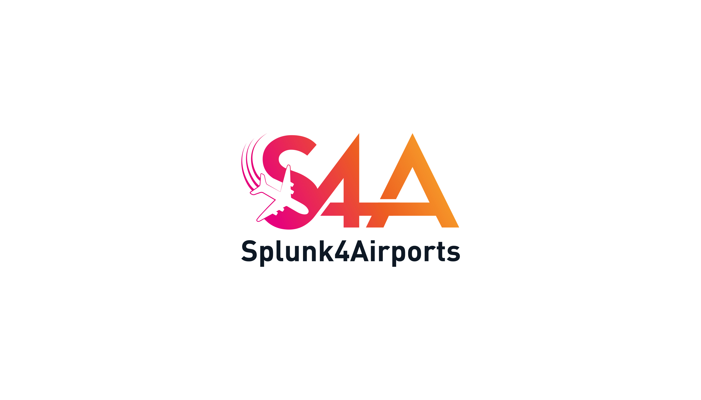

## Welcome to Splunk 4 Airports Common Information Model

Splunk means Data to Everything. When Airports use Splunk for traditional ITOps or Security use cases. They are unlocking how valuable this solution is for other areas of their business, like monitoring Airfield and Baggage operations. The challenge is, domain knowledge in these fields are required to get there. Without this domain knowledge it's challenging to build accurate reporting for operational use cases. This Common Information Model, and associated Splunk4Airports App, is aimed at helping you, the airport employee, use Splunk to monitor a variety of key Airport KPIs

### What is a CIM?

A Common Information Model is a collection of fields that are there to guide you in a standard of naming. The benefits of this is that it becomes much easier to create searches, reports, alerts and dashboards based on this nameset. Imagine working with Splunk in your business for multiple years, and you've built everything from scratch yourself. You recruit a new member to the team and they need to learn how to use Splunk. A Common Information Model, accompanied by a good governance structure really accelerates the new team members adoption to the Splunk Platform.

### So how does this work?

The CIM is structured in a way that separates out airport function into their own, standalone datasets. An example would be that arriving and departing aircraft are similar datasets, so belong to the "Airfield". Whereas processing passengers through security is not directly related, so those fields will belong to a dataset called "Security"

[Take me to the CIM](./contents.md)
